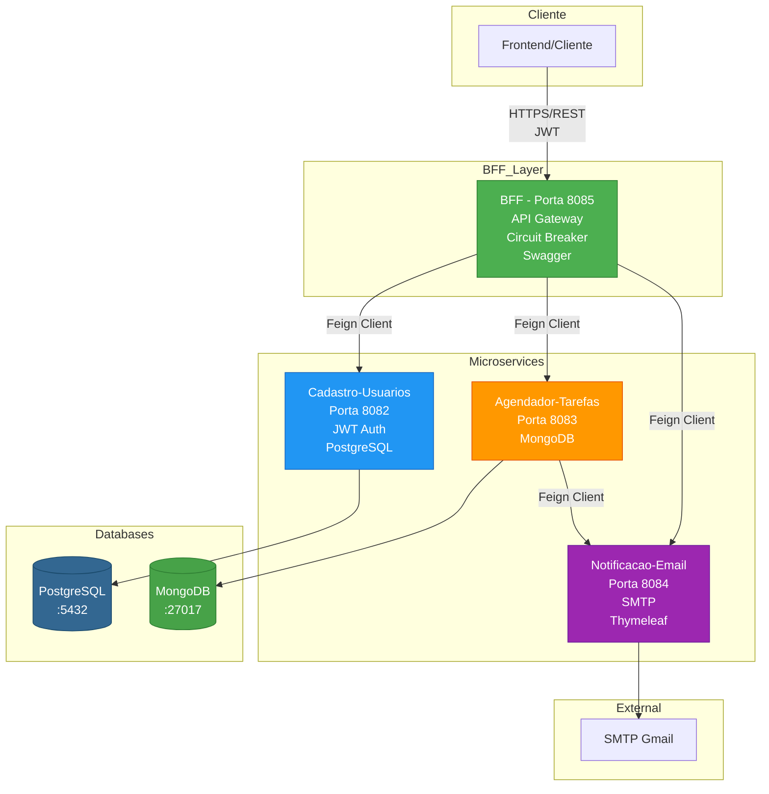
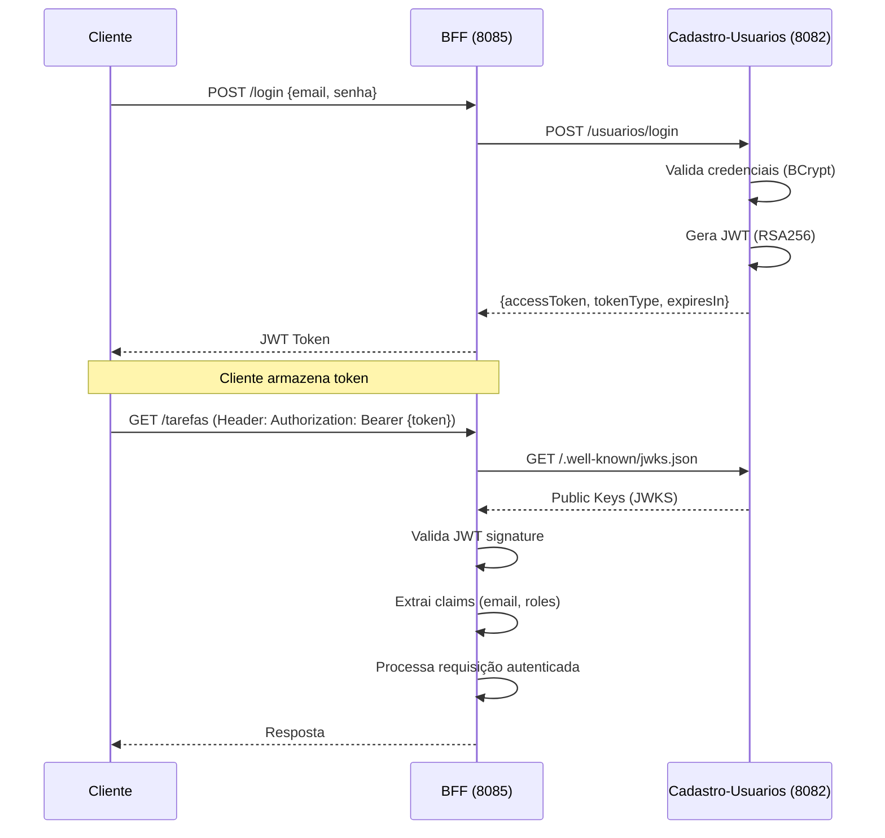
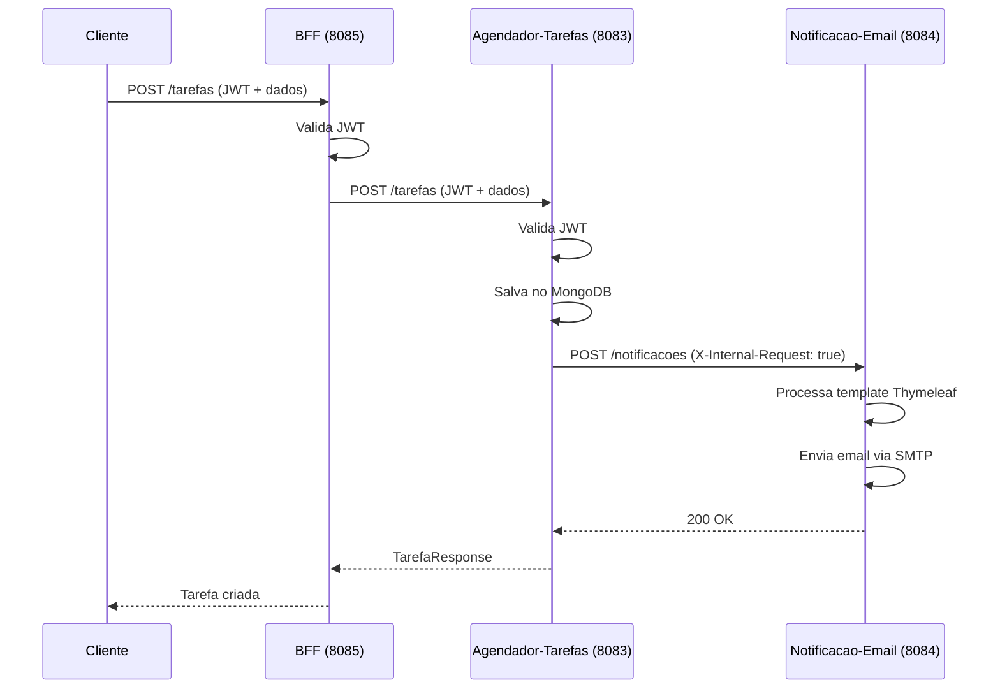
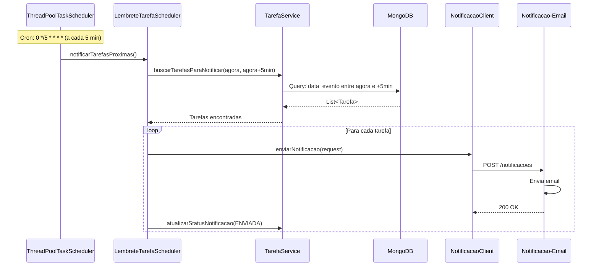

# 🚀 Sistema de Agendamento de Tarefas - Arquitetura de Microserviços

<div align="center">


**Sistema distribuído de agendamento de tarefas com arquitetura de microserviços, implementando padrões avançados de engenharia de software**

[]()
[]()
[]()

</div>

---

## 📋 Índice

- [Visão Geral](#-visão-geral)
- [Stack Tecnológico](#-stack-tecnológico)
- [Arquitetura do Sistema](#-arquitetura-do-sistema)
- [Microserviços](#-microserviços)
- [Padrões Arquiteturais](#-padrões-arquiteturais)
- [Fluxos de Integração](#-fluxos-de-integração)
- [Funcionalidades](#-funcionalidades)
- [Decisões Técnicas](#-decisões-técnicas)
- [Como Executar](#-como-executar)

---

## 🎯 Visão Geral

Sistema completo de agendamento de tarefas desenvolvido com **arquitetura de microserviços**, implementando **padrões modernos de engenharia de software** como BFF (Backend For Frontend), Circuit Breaker, Scheduler Estático, e autenticação distribuída com JWT.

### 🎯 Características Principais

| Característica | Descrição | Benefício |
|----------------|-----------|-----------|
| 🏗️ **Arquitetura de Microserviços** | 4 serviços independentes e escaláveis | Escalabilidade independente, deploy isolado, tecnologias heterogêneas |
| 🚪 **BFF Pattern** | Gateway único para frontend | Simplifica integração, reduz round-trips, agrega dados |
| 🔐 **Autenticação JWT Distribuída** | OAuth2 Resource Server com JWKS | Stateless, escalável, seguro, padrão da indústria |
| ⚡ **Circuit Breaker** | Tolerância a falhas com Resilience4j | Previne cascata de falhas, fallback methods, métricas |
| ⏰ **Scheduler Estático** | Agendamento automático de notificações | Simples e eficiente, execução baseada em expressões cron fixas |
| 📡 **Comunicação Assíncrona** | Feign Client para integração | Declarativo, integrado com Spring, load balancing |
| 📖 **Documentação OpenAPI** | Swagger UI integrado | Documentação interativa, testes, exemplos |
| ✅ **Validação de Dados** | Bean Validation em todas as camadas | Dados consistentes, menos erros, melhor UX |
| 🛡️ **Tratamento de Erros** | ControllerAdvice global | Mensagens padronizadas, logs detalhados |
| 📧 **Notificações por Email** | Templates Thymeleaf | Emails profissionais, templates reutilizáveis |

---

## 🛠️ Stack Tecnológico

### **🔷 Linguagem e Framework Core**

| Tecnologia | Versão | Uso | Destaque |
|------------|--------|-----|----------|
| **☕ Java** | **21 (LTS)** | Linguagem principal | Recursos modernos: Records, Pattern Matching, Virtual Threads |
| **🌱 Spring Boot** | **3.5.7** | Framework base | Injeção de dependência, auto-configuração, actuator |
| **☁️ Spring Cloud** | **2025.0.0** | Microserviços e integração | OpenFeign, Circuit Breaker, Service Discovery |
| **🔨 Gradle** | **8.14.3** | Build e gerenciamento | Build incremental, cache inteligente, Kotlin DSL |

### **🔒 Segurança e Autenticação**

| Tecnologia | Uso | Destaque |
|------------|-----|----------|
| **🛡️ Spring Security** | Framework de segurança | Filtros, autenticação, autorização, CSRF protection |
| **🔐 OAuth2 Resource Server** | Validação de tokens JWT | Validação automática, integração com JWKS |
| **🎫 JWT (JSON Web Tokens)** | Autenticação stateless | RSA256 assinatura, claims customizados, expiração |
| **🔑 JWKS (JSON Web Key Set)** | Distribuição de chaves públicas | Rotação de chaves, endpoint público, cache |
| **🔒 BCrypt** | Hash de senhas | Salt automático, custo configurável, resistente a rainbow tables |

### **🌐 Comunicação e Integração**

| Tecnologia | Uso | Destaque |
|------------|-----|----------|
| **📡 Spring Cloud OpenFeign** | Cliente HTTP declarativo | Interface declarativa, integração com Spring, load balancing |
| **⚡ Resilience4j Circuit Breaker** | Tolerância a falhas | Sliding window, fallback methods, métricas, retry |
| **🔄 REST API** | Comunicação entre serviços | HTTP/HTTPS, JSON, status codes, HATEOAS ready |

### **💾 Banco de Dados**

| Tecnologia | Uso | Destaque |
|------------|-----|----------|
| **🐘 PostgreSQL** | Banco relacional (usuários) | ACID, transações, relacionamentos, índices B-tree |
| **🍃 MongoDB** | Banco NoSQL (tarefas) | Schema flexível, sharding, índices compostos, aggregation pipeline |
| **📚 Spring Data JPA** | ORM para PostgreSQL | Repository pattern, queries automáticas, paginação, auditoria |
| **📖 Spring Data MongoDB** | ODM para MongoDB | Repository pattern, queries customizadas, gridFS, transactions |

### **⏰ Agendamento e Jobs**

| Tecnologia | Uso | Destaque |
|------------|-----|----------|
| **⏱️ Spring Scheduling** | Framework de agendamento | `@Scheduled`, cron, fixed rate/delay, timezone support |
| **🧵 ThreadPoolTaskScheduler** | Execução de tarefas agendadas | Pool configurável, graceful shutdown, thread naming |
| **📅 Cron Expressions** | Agendamento baseado em tempo | 6 campos (segundo, minuto, hora, dia, mês, semana), timezone |

### **📧 Notificações**

| Tecnologia | Uso | Destaque |
|------------|-----|----------|
| **📮 JavaMailSender** | Envio de emails | SMTP, MIME, attachments, encoding UTF-8, async support |
| **🎨 Thymeleaf** | Templates HTML para emails | Server-side rendering, variáveis, loops, conditionals |
| **📬 SMTP (Gmail)** | Servidor de email | TLS/SSL, autenticação OAuth2, rate limiting |

### **📝 Documentação e Validação**

| Tecnologia | Uso | Destaque |
|------------|-----|----------|
| **📖 SpringDoc OpenAPI** | Documentação Swagger | UI interativa, geração automática, schemas, exemplos |
| **✅ Bean Validation** | Validação de dados | Annotations (`@NotNull`, `@Email`, `@Size`), grupos, custom validators |
| **⚡ Lombok** | Redução de boilerplate | `@Data`, `@Builder`, `@Slf4j`, `@RequiredArgsConstructor` |

---

## 🏗️ Arquitetura do Sistema

### **Diagrama de Arquitetura Geral**

<details>
<summary>🏗️ Visualizar Diagrama de Arquitetura</summary>

```
┌─────────────────────────────────────────────────────────────────────┐
│                         CLIENTE (Frontend)                          │
│                    (Web, Mobile, Postman, etc)                      │
└──────────────────────────────┬──────────────────────────────────────┘
                                │
                                │ HTTPS / REST
                                │ JWT Authentication
                                ▼
┌─────────────────────────────────────────────────────────────────────┐
│                    BFF (Backend For Frontend)                        │
│                      Porta: 8085                                    │
│  ┌──────────────────────────────────────────────────────────────┐  │
│  │ • API Gateway único                                           │  │
│  │ • Circuit Breaker (Resilience4j)                              │  │
│  │ • Orquestração de chamadas                                   │  │
│  │ • Documentação Swagger                                        │  │
│  │ • Validação JWT                                               │  │
│  └──────────────────────────────────────────────────────────────┘  │
└─────┬──────────────┬──────────────┬─────────────────────────────────┘
      │              │              │
      │ Feign        │ Feign        │ Feign
      │ Client       │ Client       │ Client
      │              │              │
      ▼              ▼              ▼
┌──────────┐  ┌──────────────┐  ┌──────────────┐
│Cadastro │  │ Agendador   │  │ Notificação │
│Usuários │  │  Tarefas     │  │    Email     │
│  :8082  │  │   :8083      │  │    :8084     │
└────┬────┘  └──────┬───────┘  └──────┬───────┘
     │               │                  │
     │               │                  │
     ▼               ▼                  ▼
┌──────────┐  ┌──────────────┐  ┌──────────────┐
│PostgreSQL│  │   MongoDB    │  │  SMTP Gmail │
│  :5432   │  │    :27017    │  │             │
└──────────┘  └──────────────┘  └──────────────┘
```

</details>

### **Diagrama de Arquitetura em Mermaid**

<details>
<summary>📊 Visualizar Diagrama Mermaid (Renderizado no GitHub)</summary>



</details>

### **Fluxograma de Comunicação entre Microserviços**

```
┌─────────────────────────────────────────────────────────────────┐
│                    FLUXO DE AUTENTICAÇÃO                        │
└─────────────────────────────────────────────────────────────────┘

Cliente → BFF (/login)
    │
    ├─→ Cadastro-Usuarios (/usuarios/login)
    │       │
    │       ├─→ Valida credenciais (BCrypt)
    │       ├─→ Gera JWT (RSA256)
    │       └─→ Retorna token
    │
    └─→ BFF retorna token para cliente

Cliente → BFF (requisições autenticadas)
    │
    ├─→ BFF valida JWT via JWKS (http://8082/.well-known/jwks.json)
    │
    └─→ BFF processa requisição

┌─────────────────────────────────────────────────────────────────┐
│              FLUXO DE CRIAÇÃO DE TAREFA                         │
└─────────────────────────────────────────────────────────────────┘

Cliente → BFF (POST /tarefas)
    │
    ├─→ BFF valida JWT
    │
    ├─→ BFF → Agendador-Tarefas (POST /tarefas)
    │       │
    │       ├─→ Valida JWT
    │       ├─→ Salva no MongoDB
    │       ├─→ Envia email de criação (Notificacao-Email)
    │       └─→ Retorna tarefa criada
    │
    ├─→ BFF → Notificacao-Email (POST /notificacoes)
    │       │
    │       ├─→ Valida header interno
    │       ├─→ Processa template Thymeleaf
    │       └─→ Envia email via SMTP
    │
    └─→ BFF retorna resposta ao cliente

┌─────────────────────────────────────────────────────────────────┐
│              FLUXO DE NOTIFICAÇÃO AGENDADA                      │
└─────────────────────────────────────────────────────────────────┘

Scheduler (Cron) → LembreteTarefaScheduler
    │
    ├─→ Busca tarefas (data_evento entre agora e +5min)
    │
    ├─→ Para cada tarefa encontrada:
    │       │
    │       ├─→ Agendador-Tarefas → Notificacao-Email
    │       │       │
    │       │       ├─→ Processa template
    │       │       └─→ Envia email de lembrete
    │       │
    │       └─→ Atualiza status_notificacao = ENVIADA
    │
    └─→ Log de execução
```

---

## 🔧 Microserviços

### **1. Cadastro-Usuarios** (Porta 8082)

**Responsabilidade:** Gerenciamento de usuários e autenticação JWT

#### **Stack Tecnológico:**
- **Spring Boot 3.5.7**
- **Spring Data JPA** - Persistência relacional
- **PostgreSQL** - Banco de dados
- **Spring Security + OAuth2** - Autenticação
- **JWT (RSA256)** - Tokens assinados
- **BCrypt** - Hash de senhas
- **Bean Validation** - Validação de dados

#### **Funcionalidades:**
- ✅ Registro de usuários com validação completa
- ✅ Login com geração de JWT
- ✅ Endpoint JWKS público (`/.well-known/jwks.json`)
- ✅ Gerenciamento de perfis de usuário
- ✅ Validação de email e dados pessoais
- ✅ Suporte a múltiplos endereços e telefones

#### **Endpoints Principais:**
```
POST   /usuarios/login          - Autenticação
POST   /usuarios/registro       - Registro de novo usuário
GET    /.well-known/jwks.json  - Chaves públicas JWT
GET    /usuarios                - Listar usuários (ADMIN)
GET    /usuarios/email/{email}  - Buscar por email (ADMIN)
```

#### **Arquitetura Interna:**
```
Controller Layer
    ↓
Service Layer (Business Logic)
    ↓
Repository Layer (JPA)
    ↓
PostgreSQL Database
```

#### **Decisões Técnicas:**
- **PostgreSQL** escolhido para garantir ACID e relacionamentos complexos
- **JWT com RSA256** para assinatura assimétrica (mais seguro)
- **JWKS endpoint** permite rotação de chaves sem downtime
- **BCrypt** com salt automático para segurança de senhas

---

### **2. Agendador-Tarefas** (Porta 8083)

**Responsabilidade:** Gerenciamento de tarefas e agendamento de notificações

#### **Stack Tecnológico:**
- **Spring Boot 3.5.7**
- **Spring Data MongoDB** - Persistência NoSQL
- **MongoDB** - Banco de dados
- **Spring Scheduling** - Agendamento de jobs
- **ThreadPoolTaskScheduler** - Execução dinâmica
- **Spring Cloud OpenFeign** - Cliente HTTP
- **OAuth2 Resource Server** - Validação JWT

#### **Funcionalidades:**
- ✅ CRUD completo de tarefas
- ✅ Busca e filtros avançados
- ✅ Scheduler dinâmico controlável via API
- ✅ Notificações automáticas de lembretes
- ✅ Gerenciamento de status e prioridades
- ✅ Suporte a recorrência de tarefas
- ✅ Validação de datas e regras de negócio

#### **Endpoints Principais:**
```
POST   /tarefas                    - Criar tarefa
GET    /tarefas                    - Listar tarefas (com filtros)
GET    /tarefas/{id}               - Buscar tarefa
PUT    /tarefas/{id}                - Atualizar tarefa
PATCH  /tarefas/{id}                - Atualização parcial
DELETE /tarefas/{id}                - Deletar tarefa
PUT    /tarefas/{id}/concluir       - Concluir tarefa
PATCH  /tarefas/{id}/status-notificacao/{status} - Atualizar status
```

#### **Arquitetura Interna:**
```
Controller Layer
    ↓
Service Layer
    └─→ TarefaService (CRUD)
        ↓
Repository Layer (MongoDB)
    ↓
MongoDB Database
    ↓
Scheduler Layer
    └─→ LembreteTarefaScheduler (Job executado dinamicamente)
        ↓
Feign Client → Notificacao-Email
```

#### **Decisões Técnicas:**
- **MongoDB** escolhido para flexibilidade de schema e escalabilidade horizontal
- **Scheduler dinâmico** permite mudança de cron sem reiniciar serviço
- **ThreadPoolTaskScheduler** com pool configurável para performance
- **Queries otimizadas** com índices em campos frequentes
- **Validação de datas** customizada para regras de negócio

---

### **3. Notificacao-Email** (Porta 8084)

**Responsabilidade:** Envio de emails transacionais e notificações

#### **Stack Tecnológico:**
- **Spring Boot 3.5.7**
- **JavaMailSender** - Envio de emails
- **Thymeleaf** - Templates HTML
- **Spring Security** - Proteção de endpoints
- **OAuth2 Resource Server** - Validação JWT

#### **Funcionalidades:**
- ✅ Envio de emails HTML formatados
- ✅ Templates Thymeleaf dinâmicos
- ✅ Suporte a SMTP (Gmail configurado)
- ✅ Proteção de endpoints internos
- ✅ Tratamento de erros de envio
- ✅ Logging detalhado de operações

#### **Endpoints Principais:**
```
POST   /notificacoes  - Enviar notificação (requer header interno ou JWT)
```

#### **Arquitetura Interna:**
```
Controller Layer
    ↓
Service Layer (EmailService)
    ├─→ Processa template Thymeleaf
    ├─→ Prepara MimeMessage
    └─→ Envia via JavaMailSender
        ↓
SMTP Server (Gmail)
```

#### **Decisões Técnicas:**
- **Thymeleaf** para templates server-side reutilizáveis
- **MimeMessageHelper** para emails HTML com encoding UTF-8
- **Proteção dupla**: JWT para externos, header interno para serviços
- **Templates separados** para diferentes tipos de notificação

---

### **4. BFF (Backend For Frontend)** (Porta 8085)

**Responsabilidade:** Gateway único, orquestração e agregação de dados

#### **Stack Tecnológico:**
- **Spring Boot 3.5.7**
- **Spring Cloud OpenFeign** - Clientes HTTP declarativos
- **Resilience4j Circuit Breaker** - Tolerância a falhas
- **SpringDoc OpenAPI** - Documentação Swagger
- **OAuth2 Resource Server** - Validação JWT
- **Bean Validation** - Validação de requisições

#### **Funcionalidades:**
- ✅ API Gateway único para frontend
- ✅ Orquestração de chamadas a microserviços
- ✅ Circuit Breaker para resiliência
- ✅ Documentação Swagger interativa
- ✅ Validação centralizada
- ✅ Tratamento de erros unificado
- ✅ Controle de scheduler via API

#### **Endpoints Principais:**
```
AUTENTICAÇÃO:
POST   /login                    - Login (público)
POST   /registro                 - Registro (público)
GET    /perfil                   - Obter perfil (autenticado)

TAREFAS:
POST   /tarefas                  - Criar tarefa
GET    /tarefas                  - Listar tarefas (com filtros)
GET    /tarefas/{id}             - Buscar tarefa
DELETE /tarefas/{id}             - Deletar tarefa
PATCH  /tarefas/{id}/concluir    - Concluir tarefa


DOCUMENTAÇÃO:
GET    /swagger-ui.html          - Interface Swagger (público)
GET    /v3/api-docs              - OpenAPI JSON (público)
```

#### **Arquitetura Interna:**
```
Controller Layer
    ├─→ UsuarioController
    ├─→ TarefaController
    └─→ SchedulerController
        ↓
Service Layer
    ├─→ UsuarioService
    ├─→ TarefaService (com Circuit Breaker)
    └─→ SchedulerService
        ↓
Feign Clients
    ├─→ UsuarioClient → Cadastro-Usuarios
    ├─→ TarefaClient → Agendador-Tarefas
    ├─→ SchedulerClient → Agendador-Tarefas
    └─→ NotificacaoClient → Notificacao-Email
        ↓
Microserviços
```

#### **Decisões Técnicas:**
- **BFF Pattern** reduz chamadas do frontend e simplifica integração
- **Circuit Breaker** previne cascata de falhas
- **Fallback methods** garantem resposta mesmo em falhas
- **Feign Client** simplifica comunicação HTTP declarativa
- **Swagger** para documentação interativa e testes

---

## 🎨 Padrões Arquiteturais Implementados

### **1. Microservices Architecture**
- **Separação de responsabilidades** por domínio
- **Independência de deploy** e escalabilidade
- **Tecnologias heterogêneas** (PostgreSQL + MongoDB)
- **Comunicação via REST** com contratos bem definidos

### **2. BFF (Backend For Frontend) Pattern**
- **Gateway único** para simplificar integração frontend
- **Agregação de dados** de múltiplos serviços
- **Transformação de modelos** específica para frontend
- **Redução de round-trips** entre cliente e servidor

### **3. Circuit Breaker Pattern**
- **Resilience4j** implementado no BFF
- **Proteção contra cascata de falhas**
- **Fallback methods** para degradação graciosa
- **Métricas de saúde** dos serviços

### **4. API Gateway Pattern**
- **Ponto único de entrada** para todas as requisições
- **Autenticação centralizada** (JWT validation)
- **Rate limiting** e throttling (preparado)
- **Logging e monitoramento** centralizados

### **5. Distributed Authentication (JWT)**
- **Stateless authentication** sem sessões
- **JWKS endpoint** para distribuição de chaves
- **OAuth2 Resource Server** em todos os serviços
- **Token-based security** escalável

### **6. Scheduler Pattern (Estático)**
- **Agendamento automático** com expressões cron fixas
- **ThreadPoolTaskScheduler** para execução assíncrona
- **Cron expressions** configuradas via application.yaml

### **7. Repository Pattern**
- **Abstração de persistência** em todos os serviços
- **Spring Data** para simplificar acesso a dados
- **Queries customizadas** quando necessário

### **8. DTO Pattern**
- **Separação de modelos** de API e entidades
- **Validação de entrada** com Bean Validation
- **Mappers** para conversão entre camadas

---

## 🔄 Fluxos de Integração Detalhados

### **Fluxo 1: Autenticação e Autorização**

<details>
<summary>📊 Diagrama de Sequência - Autenticação</summary>



</details>

### **Fluxo 2: Criação de Tarefa com Notificação**

<details>
<summary>📊 Diagrama de Sequência - Criação de Tarefa</summary>



</details>

### **Fluxo 3: Scheduler de Notificações**

<details>
<summary>📊 Diagrama de Sequência - Scheduler Automático</summary>



</details>


---

## 💡 Funcionalidades Detalhadas

### **Gerenciamento de Usuários**
- Registro com validação completa (email, senha, dados pessoais)
- Login seguro com JWT
- Gerenciamento de perfis
- Suporte a múltiplos endereços e telefones
- Roles e permissões (ADMIN, USUARIO)

### **Gerenciamento de Tarefas**
- CRUD completo com validações
- Filtros por data (período)
- Busca por ID
- Atualização parcial (PATCH)
- Conclusão de tarefas
- Gerenciamento de status e prioridades
- Suporte a recorrência (DIARIA, SEMANAL, MENSAL, etc)

### **Sistema de Notificações**
- Email de criação imediato
- Lembrete automático 5 minutos antes do evento
- Templates HTML profissionais
- Status de notificação (PENDENTE, ENVIADA, ERRO)
- Retry automático em caso de falha


---

## 🎯 Decisões Técnicas e Justificativas

### **1. Por que Microserviços?**
- **Escalabilidade independente**: Cada serviço escala conforme demanda
- **Tecnologias adequadas**: PostgreSQL para relacionamentos, MongoDB para flexibilidade
- **Deploy independente**: Atualizações sem afetar todo o sistema
- **Falhas isoladas**: Problema em um serviço não derruba o sistema

### **2. Por que BFF Pattern?**
- **Simplifica frontend**: Uma única API para consumir
- **Reduz round-trips**: Agrega dados de múltiplos serviços
- **Transformação de dados**: Adapta modelos para necessidades do frontend
- **Centraliza lógica**: Circuit breaker, validação, tratamento de erros

### **3. Por que JWT Distribuído?**
- **Stateless**: Não precisa de sessões no servidor
- **Escalável**: Funciona em múltiplas instâncias
- **Seguro**: Assinatura RSA256 com chaves rotacionáveis
- **Padrão da indústria**: OAuth2 Resource Server

### **4. Por que Circuit Breaker?**
- **Resiliência**: Previne cascata de falhas
- **Degradação graciosa**: Fallback methods garantem resposta
- **Métricas**: Monitora saúde dos serviços
- **Recuperação automática**: Tenta novamente após timeout

### **5. Por que Scheduler Estático?**
- **Simples e eficiente**: Execução baseada em expressões cron fixas
- **Confiável**: Utiliza o framework de agendamento do Spring
- **Manutenção**: Fácil de configurar e monitorar

### **6. Por que MongoDB para Tarefas?**
- **Schema flexível**: Fácil adicionar novos campos
- **Performance**: Queries rápidas com índices
- **Escalabilidade horizontal**: Sharding nativo
- **Documentos**: Estrutura natural para tarefas

### **7. Por que PostgreSQL para Usuários?**
- **ACID**: Garantia de consistência
- **Relacionamentos**: Múltiplos endereços/telefones
- **Transações**: Operações atômicas
- **Maturidade**: Banco relacional consolidado

---

## 🚀 Como Executar

### **Pré-requisitos**
- Java 21
- PostgreSQL 12+ (porta 5432)
- MongoDB 4.4+ (porta 27017)
- Gradle 8.14.3 (ou usar gradlew)

### **Configuração dos Bancos**

**PostgreSQL:**
```sql
CREATE DATABASE "cadastro-usuarios";
CREATE USER root WITH PASSWORD 'root';
GRANT ALL PRIVILEGES ON DATABASE "cadastro-usuarios" TO root;
```

**MongoDB:**
```bash
# MongoDB inicia automaticamente na porta 27017
# Database será criado automaticamente: agendador-tarefas
```

### **Ordem de Inicialização**

```bash
# 1. Cadastro-Usuarios (OBRIGATÓRIO PRIMEIRO)
cd cadastro-usuarios
./gradlew bootRun

# 2. Notificacao-Email
cd ../notificacao-email
./gradlew bootRun

# 3. Agendador-Tarefas
cd ../agendador-tarefas
./gradlew bootRun

# 4. BFF (ÚLTIMO)
cd ../bff-agendador-tarefas
./gradlew bootRun
```

### **Verificação**

1. **JWKS Endpoint:**
```bash
curl http://localhost:8082/.well-known/jwks.json
```

2. **Swagger UI:**
```
http://localhost:8085/swagger-ui.html
```

3. **Status dos Serviços:**
```bash
# Verificar portas
netstat -ano | findstr "8082 8083 8084 8085"
```

---

## 📊 Métricas e Monitoramento

### **Circuit Breaker (Resilience4j)**
- **Sliding Window Size**: 10 requisições
- **Failure Rate Threshold**: 50%
- **Wait Duration**: 10 segundos
- **Minimum Calls**: 5 antes de abrir circuito

### **Scheduler**
- **Pool Size**: 5 threads
- **Shutdown Graceful**: 60 segundos
- **Thread Prefix**: "scheduler-"

---

## 🔒 Segurança

### **Autenticação**
- JWT com algoritmo RSA256
- Tokens expiram em 3600 segundos (1 hora)
- JWKS endpoint público para validação
- BCrypt para hash de senhas

### **Autorização**
- Roles: `SCOPE_ADMIN`, `SCOPE_USUARIO`
- `@PreAuthorize` em endpoints sensíveis
- Validação de ownership (usuário só acessa suas tarefas)

### **Endpoints Públicos**
- `/login` e `/registro` (BFF)
- `/swagger-ui/**` (BFF)
- `/.well-known/jwks.json` (Cadastro-Usuarios)

---

## 📚 Documentação Adicional

- [📋 Exemplos de Requisições](EXEMPLOS_REQUISICOES.md) - Exemplos práticos de todas as APIs
- [📊 Relatório de Análise](RELATORIO_ANALISE_SISTEMA.md) - Análise técnica detalhada
- [✅ Relatório Final de Verificação](RELATORIO_FINAL_VERIFICACAO.md) - Checklist completo

---

## 🎓 Habilidades Demonstradas

### **🏗️ Arquitetura de Software**
- ✅ **Microserviços** - 4 serviços independentes com responsabilidades bem definidas
- ✅ **Padrões de Design** - BFF, API Gateway, Circuit Breaker, Repository, DTO
- ✅ **Separação de Responsabilidades** - Cada serviço com domínio específico
- ✅ **Princípios SOLID** - Single Responsibility, Dependency Inversion, Open/Closed
- ✅ **Arquitetura Hexagonal** - Separação de camadas (Controller, Service, Repository)
- ✅ **Domain-Driven Design (DDD)** - Modelagem baseada em domínios de negócio

### **💻 Backend Development**
- ✅ **Spring Boot Avançado** - Auto-configuração, profiles, actuator, devtools
- ✅ **Spring Cloud** - OpenFeign, Service Discovery, Configuration Management
- ✅ **RESTful APIs** - Design de recursos, status codes, HATEOAS
- ✅ **Integração entre Serviços** - Comunicação síncrona via HTTP/REST
- ✅ **Tratamento de Erros** - ControllerAdvice, exceções customizadas, mensagens padronizadas
- ✅ **Validação de Dados** - Bean Validation em todas as camadas

### **🔒 Segurança**
- ✅ **OAuth2 / JWT** - Autenticação stateless distribuída
- ✅ **Spring Security** - Filtros, autenticação, autorização baseada em roles
- ✅ **Autenticação Distribuída** - JWKS endpoint para validação de tokens
- ✅ **Criptografia de Senhas** - BCrypt com salt automático
- ✅ **Proteção de Endpoints** - `@PreAuthorize`, roles, scopes
- ✅ **Headers de Segurança** - Proteção contra CSRF, XSS

### **💾 Banco de Dados**
- ✅ **PostgreSQL** - Banco relacional com ACID, transações, relacionamentos
- ✅ **MongoDB** - Banco NoSQL com schema flexível, índices, aggregation
- ✅ **Spring Data JPA** - Repository pattern, queries automáticas, paginação
- ✅ **Spring Data MongoDB** - Repository pattern, queries customizadas
- ✅ **Queries Otimizadas** - Índices, projeções, paginação
- ✅ **Migrations** - Schema versionamento (preparado)

### **🌐 Comunicação**
- ✅ **Feign Client** - Cliente HTTP declarativo com integração Spring
- ✅ **HTTP/REST** - Protocolo de comunicação entre serviços
- ✅ **Serialização JSON** - Jackson com configurações customizadas
- ✅ **Circuit Breaker** - Resilience4j com fallback methods
- ✅ **Retry Logic** - Tentativas automáticas em falhas transitórias
- ✅ **Timeout Configuration** - Timeouts configuráveis por serviço

### **⚙️ DevOps e Operações**
- ✅ **Scheduler Estático** - Agendamento automático de tarefas
- ✅ **Logging Estruturado** - SLF4J com Logback, níveis configuráveis
- ✅ **Tratamento de Erros** - Logs detalhados, stack traces, contexto
- ✅ **Monitoramento** - Health checks, métricas (preparado)
- ✅ **Graceful Shutdown** - Finalização ordenada de threads e conexões
- ✅ **Configuration Management** - YAML profiles, variáveis de ambiente

### **✨ Qualidade de Código**
- ✅ **Validação de Dados** - Bean Validation em DTOs e entidades
- ✅ **Tratamento de Exceções** - Hierarquia de exceções, mensagens claras
- ✅ **Documentação (Swagger)** - OpenAPI 3.0, exemplos, schemas
- ✅ **Código Limpo** - Nomenclatura clara, métodos pequenos, DRY
- ✅ **Testes** - Estrutura preparada para unit e integration tests
- ✅ **Lombok** - Redução de boilerplate, código mais limpo

---

## 📈 Resumo Executivo

### **Complexidade e Escala**
- **4 Microserviços** independentes e escaláveis
- **2 Bancos de Dados** diferentes (PostgreSQL + MongoDB)
- **1 Gateway BFF** orquestrando todas as comunicações
- **Padrões Arquiteturais** modernos implementados
- **Segurança Distribuída** com JWT e OAuth2

### **Tecnologias de Ponta**
- **Java 21 LTS** - Recursos modernos da linguagem
- **Spring Boot 3.5.7** - Framework enterprise
- **Spring Cloud 2025.0.0** - Microserviços e integração
- **Resilience4j** - Tolerância a falhas
- **OpenAPI 3.0** - Documentação interativa

### **Diferenciais Técnicos**
1. **Scheduler Estático** - Agendamento automático com expressões cron
2. **Circuit Breaker** - Resiliência e fallback automático
3. **JWT Distribuído** - Autenticação stateless escalável
4. **BFF Pattern** - Gateway único simplificando frontend
5. **Templates Thymeleaf** - Emails HTML profissionais

### **Qualidade e Boas Práticas**
- ✅ Separação de responsabilidades
- ✅ Princípios SOLID aplicados
- ✅ Validação em todas as camadas
- ✅ Tratamento de erros robusto
- ✅ Documentação completa (Swagger)
- ✅ Código limpo e organizado
- ✅ Logging estruturado
- ✅ Configuração externalizada

---

## 👨‍💻 Autor

**Nivaldo Silva**

Desenvolvedor Backend especializado em arquitetura de microserviços, Spring Boot e sistemas distribuídos.

**Habilidades Demonstradas:**
- 🏗️ Arquitetura de Software (Microserviços, DDD, SOLID)
- 💻 Backend Development (Spring Boot, Spring Cloud, REST APIs)
- 🔒 Segurança (OAuth2, JWT, Spring Security)
- 💾 Banco de Dados (PostgreSQL, MongoDB, JPA)
- 🌐 Integração (Feign, Circuit Breaker, HTTP/REST)
- ⚙️ DevOps (Scheduler, Logging, Monitoramento)
- ✨ Qualidade (Validação, Testes, Documentação)

---

## 📄 Licença

Este projeto é um exemplo de arquitetura de microserviços para fins educacionais e portfólio.

---

<div align="center">

**Desenvolvido com ❤️ usando Spring Boot e arquitetura de microserviços**

[]()
[]()
[]()
[]()
[]()

**⭐ Se este projeto foi útil, considere dar uma estrela! ⭐**

</div>

