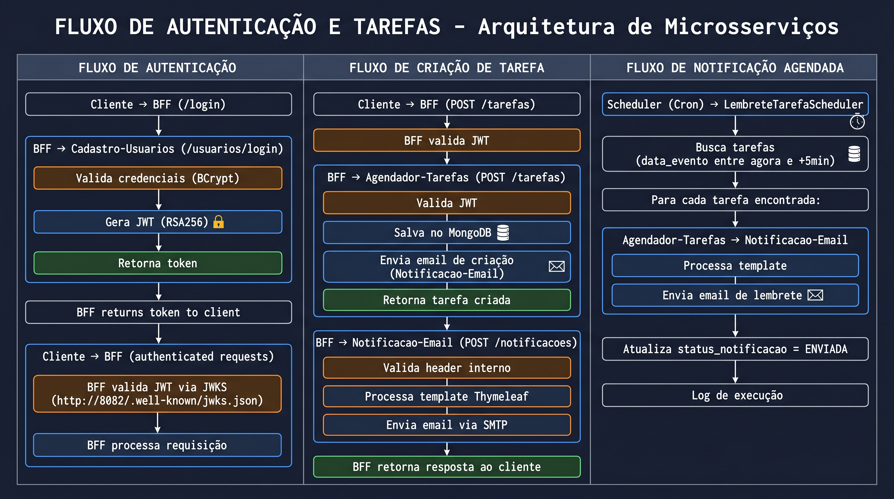

# Sistema de Agendamento de Tarefas — Arquitetura de Microsserviços

<div align="center">


</div>

---

## Visão Geral

Sistema de agendamento de tarefas com arquitetura de microsserviços, composto por 4 serviços independentes que se comunicam via REST. Implementa BFF Pattern, autenticação JWT distribuída com JWKS, Circuit Breaker e notificações automáticas por email.



---

## Microsserviços

| Serviço | Porta | Responsabilidade | Banco |
|---------|-------|-----------------|-------|
| **cadastro-usuarios** | 8082 | Autenticação e gerenciamento de usuários | PostgreSQL |
| **agendador-tarefas** | 8083 | CRUD de tarefas e scheduler de lembretes | MongoDB |
| **notificacao-email** | 8084 | Envio de emails com templates Thymeleaf | — |
| **bff-agendador-tarefas** | 8085 | API Gateway, Circuit Breaker, Swagger | — |

### cadastro-usuarios

Registro, login e emissão de JWT (RSA256). Expõe o endpoint `/.well-known/jwks.json` para que os demais serviços validem tokens sem depender de sessão central.

```
POST   /usuarios/login
POST   /usuarios/registro
GET    /.well-known/jwks.json
GET    /usuarios                  (ADMIN)
GET    /usuarios/email/{email}    (ADMIN)
GET    /usuarios/perfil
PUT    /usuarios/perfil
POST   /usuarios/endereco
POST   /usuarios/telefone
DELETE /usuarios/{id}             (ADMIN)
```

### agendador-tarefas

CRUD completo de tarefas com filtros por período. Scheduler cron busca tarefas com evento nos próximos 5 minutos e aciona o serviço de email, atualizando o `status_notificacao` para `ENVIADA`.

```
POST   /tarefas
GET    /tarefas
GET    /tarefas/{id}
PUT    /tarefas/{id}
PATCH  /tarefas/{id}
DELETE /tarefas/{id}
PUT    /tarefas/{id}/concluir
PATCH  /tarefas/{id}/status-notificacao/{status}
GET    /tarefas/{id}/usuario
GET    /tarefas/por-email/{email}  (ADMIN)
```

### notificacao-email

Recebe requisições internas (header `X-Internal-Request`) ou autenticadas via JWT, processa template Thymeleaf e envia via SMTP (Gmail).

```
POST   /notificacoes
```

### bff-agendador-tarefas

Ponto único de entrada para o cliente. Valida JWT via JWKS, orquestra chamadas aos serviços internos e aplica Circuit Breaker com fallback. Expõe Swagger UI.

```
POST   /login
POST   /registro
GET    /perfil
POST   /tarefas
GET    /tarefas
GET    /tarefas/{id}
DELETE /tarefas/{id}
PUT    /tarefas/{id}/concluir
GET    /swagger-ui.html
```

---

## Stack

| Categoria | Tecnologias |
|-----------|-------------|
| Core | Java 21, Spring Boot 3.5.7, Spring Cloud 2025.0.0, Gradle 8.14.3 |
| Segurança | Spring Security, OAuth2 Resource Server, JWT RSA256, JWKS, BCrypt |
| Comunicação | Spring Cloud OpenFeign, Resilience4j Circuit Breaker |
| Persistência | PostgreSQL + Spring Data JPA, MongoDB + Spring Data MongoDB |
| Agendamento | Spring Scheduling (`@Scheduled`), ThreadPoolTaskScheduler |
| Email | JavaMailSender, Thymeleaf |
| Documentação | SpringDoc OpenAPI 3.0, Bean Validation, Lombok |

---

## Algumas decisões de projeto

O sistema usa dois bancos por motivos práticos: PostgreSQL no `cadastro-usuarios` porque usuários têm relacionamentos reais (endereços, telefones) que pedem estrutura relacional; MongoDB no `agendador-tarefas` porque o schema de tarefas é mais livre e as queries do scheduler — buscar por intervalo de data — funcionam bem com documentos.

A autenticação funciona sem servidor central. O `cadastro-usuarios` emite tokens JWT assinados com RSA256 e expõe o endpoint `/.well-known/jwks.json` com a chave pública. Cada serviço valida o token por conta própria consultando esse endpoint, o que mantém tudo stateless.

O BFF existe para o cliente não precisar conhecer os serviços internos. Toda requisição passa por ele: ele valida o JWT, chama os serviços necessários via Feign e aplica Circuit Breaker com fallback caso algum serviço esteja fora.

O scheduler foi mantido estático de propósito. A expressão cron fica no `application.yaml` e o Spring cuida do resto — sem Quartz, sem banco de agendamentos, sem infraestrutura extra.

---

## Como executar

**Pré-requisitos:** Java 21, PostgreSQL 12+ rodando na 5432, MongoDB 4.4+ rodando na 27017.

**Configuração do PostgreSQL:**
```sql
CREATE DATABASE "cadastro-usuarios";
CREATE USER root WITH PASSWORD 'root';
GRANT ALL PRIVILEGES ON DATABASE "cadastro-usuarios" TO root;
```

O MongoDB não precisa de configuração — o banco `agendador-tarefas` é criado automaticamente na primeira execução.

**Ordem de inicialização** (importante seguir):
```bash
# 1. Primeiro — os outros serviços dependem do JWKS que ele expõe
cd cadastro-usuarios && ./gradlew bootRun

# 2. Email
cd notificacao-email && ./gradlew bootRun

# 3. Tarefas
cd agendador-tarefas && ./gradlew bootRun

# 4. BFF por último
cd bff-agendador-tarefas && ./gradlew bootRun
```

**Verificando se subiu:**
```bash
# JWKS do cadastro-usuarios
curl http://localhost:8082/.well-known/jwks.json

# Swagger UI do BFF
http://localhost:8085/swagger-ui.html

# Portas ativas (Windows)
netstat -ano | findstr "8082 8083 8084 8085"
```

